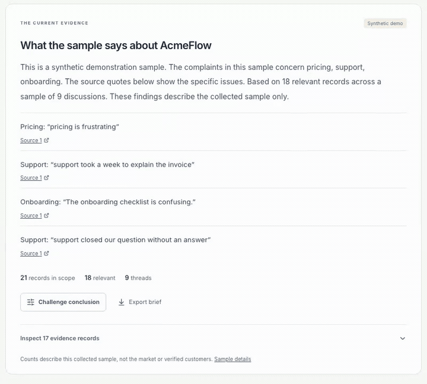

# Overheard

**Listen closer. Build better.**

Turn scattered product feedback into a clear view of the issues behind it. Compare sources, inspect the original words, ask a question, and export a brief that keeps its evidence.

[**Open the workspace →**](https://cua-parse-demo.vercel.app/) · [Watch the walkthrough](https://cua-parse-demo.vercel.app/#walkthrough) · [How it works](docs/OVERHEARD_ALIGNMENT.md)

The workspace opens immediately. Explore the clearly labelled synthetic sample, or import your own **OverHeard JSON or JSONL export**. Imported records stay in the current browser tab. No account or API key is required.

## From feedback to a decision

1. **Choose a product.** See feedback volume, known sentiment, and each source’s share.
2. **Inspect a pain point.** Open the original records behind a ranked issue. Missing labels stay unknown.
3. **Test the scope.** Filter by source, date, sentiment, or text. Exclude a thread and see what changes.
4. **Ask Vox.** Search the selected evidence with a typed question. Answers show their source records and limits.
5. **Export the brief.** Take the same scope, counts, and citations into a product discussion.

Vox in the public workspace uses deterministic evidence search. It does not generate new sentiment labels or pretend that saved text is a live model answer. Your selected scope drives the dashboard, evidence list, answers, and brief.

## Evidence first

- **Comparable views.** Source counts stay visible. Selected search and brief examples are balanced across sources. Unrelated engagement scores are not combined into a ranking.
- **Traceable statements.** Quotes preserve the imported text. Public source links are available when supplied without embedded credentials.
- **Honest gaps.** Unknown sentiment, missing dates, invalid rows, and off-topic records are reported. Sample data is never described as collected customer feedback.
- **A bounded free workspace.** The public app runs in the browser with no backend or paid provider calls. Imports are limited to 5 MiB and 5,000 rows. [Operation and limits](docs/HOSTING.md).

## Connected research

The repository also retains the research backend: Elasticsearch retrieval, Elastic Agent Builder over an uploaded corpus, bounded collection and imports, and ElevenLabs text and voice integration. These features use separately configured services. They are documented in the [architecture](docs/ARCHITECTURE.md) and [engineering setup](docs/SETUP.md) guides.

## Built with the team’s finished product in view

This workspace follows the product direction of [the OverHeard team project](https://github.com/tyseer2335/OverHeard): product-level analytics, ranked issues, source evidence, and Vox. Its browser import adapter accepts that project’s normalized feedback and raw collector exports. The implementation keeps the public experience independent of hosted authentication and provider accounts. [Alignment, attribution, and integration boundaries](docs/OVERHEARD_ALIGNMENT.md).

TypeScript · React · Vite · Elasticsearch · SQLite · Elastic Agent Builder · ElevenLabs

[Architecture](docs/ARCHITECTURE.md) · [Verification](docs/VERIFICATION.md) · [Contributing](CONTRIBUTING.md) · [Media provenance](docs/DEMO.md) · [Integration handoff](docs/AGENT_HANDOFF.md)
