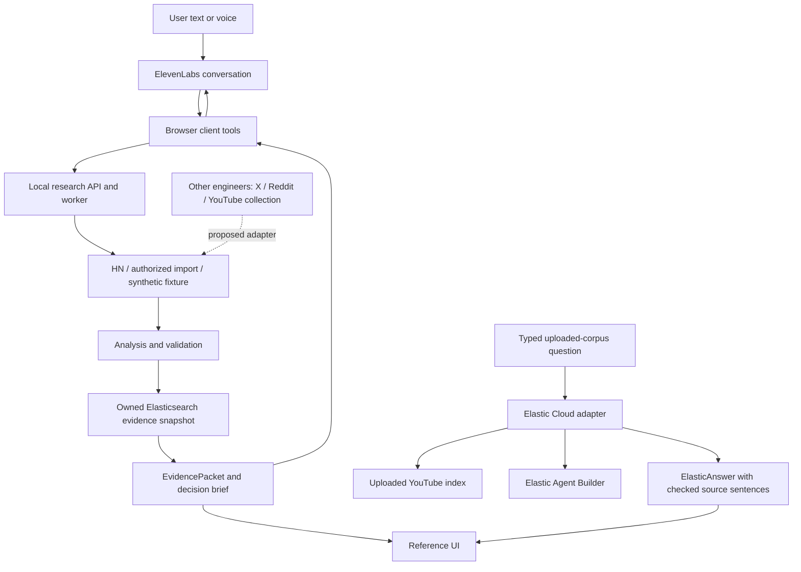

# CUA Parse: shared integration handoff

**Purpose:** give the frontend, backend, and collection engineers one plan for a single working product. Read this common document before porting code. Use the role-specific task briefs near the end for the corresponding agents.

**Review date:** 19 September 2026. **Baseline:** [PR #1](https://github.com/sabdulmajid/cua-parse/pull/1), merged at `86c4224`. The integration-readiness follow-up fixes are described below. Obtain the reviewed follow-up revision before starting new integration branches.

**Integration status:** the local reference app and its API work together. Its deterministic checks cover the main product flow. Compatibility with the other engineers' implementations is **pending inspection**. Their private repository, branches, and contracts were not available for this review. This document is a proposed common plan, not proof that those implementations already connect.

## 1. The shared product outcome

A user asks a product question by text or voice. The product finds relevant feedback, shows real progress, answers with original evidence, and lets the user change the scope. The user can exclude a dominant discussion, challenge a conclusion with actual opposing evidence, and export the current findings.

The interface should stay small: one question box, a clear source choice, a short answer, visible source links, and secondary controls in Details. The user should not need to understand agent keys, index mappings, or internal tool names.

Use this acceptance journey across all teams:

1. Ask a product question such as “What do people dislike about Microsoft Teams?”
2. Show which sources were searched and which records entered the scope.
3. Give specific findings with original quotations and clear sample counts.
4. Exclude the largest discussion and recalculate both counts and examples.
5. Challenge the negative conclusion by finding actual positive evidence in the new scope.
6. Export the same scope that the UI and analyst used.

A zero-result source, failed provider, or unlabelled record must remain visible as such. Public comments are not verified customers. Imported sentiment is not proof of a product problem.

## 2. What is implemented now

| User requirement                  | Current implementation                                                                                                                                     | Boundary to retain                                                                                                                  |
| --------------------------------- | ---------------------------------------------------------------------------------------------------------------------------------------------------------- | ----------------------------------------------------------------------------------------------------------------------------------- |
| Converse with an ElevenLabs agent | Real text and voice transports, private signed connection, four local client tools, automatic answer request after research becomes ready                  | Text requires ElevenLabs but not a microphone. Physical microphone quality still needs a manual check.                              |
| Simple research UI                | React reference client with source selection, typed input, voice controls, answer, citations, Details, exclusions, challenge, and brief export             | Another frontend may replace this client if it preserves the API and session behavior.                                              |
| Genuine asynchronous research     | One bounded worker, persisted job states, collection attempts, partial failures, cancellation, restart recovery                                            | One API process per SQLite database. This is a local app, not a hosted multi-user service.                                          |
| Original searchable evidence      | Local Elasticsearch evidence snapshots with session/research ownership, nested aspect labels, full-scope aggregations                                      | Collectors must not write directly into this internal index.                                                                        |
| Live collection                   | HN discovery and item collection with limits and fixed API origins                                                                                         | X, Reddit, and YouTube collection adapters are not implemented in this checkout.                                                    |
| Authorized imports                | Strict JSON import, up to 150 records, using `source: "import"` and `provenance: "imported"`                                                               | This temporary bridge does not preserve a native platform field. Extra fields are rejected.                                         |
| Real model analysis               | OpenAI structured labels with identity and exact-span checks; one selective repair for invalid labels                                                      | “Verified” in the current enum means local validation passed. It does not establish semantic truth or verified customer identity.   |
| Existing uploaded YouTube corpus  | Read-only Elasticsearch queries plus Elastic Agent Builder, direct typed questions, explicit product selection, source inspection, largest-video exclusion | Separate response shape and workflow. It reads the YouTube mapping and filters every count and source read to the selected product. |
| Honest fallback                   | Invented AcmeFlow fixture through real SQLite and Elasticsearch                                                                                            | Fixture evidence remains explicitly synthetic, with null source URLs.                                                               |
| Reviewable integration            | Separate backend and reference-UI commits, secret scanner, CI, portable local setup                                                                        | Reconcile shared configuration and dependencies when porting into the private main repository.                                      |

**Important remaining gap:** the ElevenLabs tool path currently works with research jobs and `EvidencePacket`. The uploaded YouTube path returns `ElasticAnswer`. The YouTube path is not connected to the four voice tools, the shared brief, or the explicit snapshot challenge flow. Do not label the product “unified multi-source voice research” until the team joins and tests these paths.

## 3. Current architecture and the integration seam



A **contract** is the shared definition of request fields, response fields, and their meaning. A **snapshot** is a fixed set of evidence for one research job. **Provenance** records where evidence came from. An **adapter** converts one collector's format into the agreed format.

The key seam is **collector output to validated evidence**. Keep acquisition separate from research sessions. The collector can own raw source storage. The research backend owns query scope, analysis, session authorization, snapshots, and the response the UI and voice agent consume.

There are two stores with different contracts:

| Store                   | Configuration     | Owner                                      | Content                                                                                                  |
| ----------------------- | ----------------- | ------------------------------------------ | -------------------------------------------------------------------------------------------------------- |
| Research evidence index | `ELASTICSEARCH_*` | Research backend                           | Strict internal mapping; session, research ID, snapshot version, validated aspects, optional embeddings. |
| Uploaded source corpus  | `ELASTIC_CLOUD_*` | Data producer; reader is the Cloud adapter | Existing original comments and uploaded metadata. Current mapping uses YouTube fields.                   |

Using Elastic Cloud for both stores later does not make their schemas interchangeable. Use separate indices and access roles. The internal mapping uses nested `aspects`; a flat list of global sentiments cannot replace it.

## 4. Findings corrected before integration

The readiness follow-up addresses concrete failures found during code review. See the linked tests and final verification report for the executed result, rather than treating this list as a test certificate.

| Finding                                                             | Corrected behavior                                                                                                      | Relevant area                                |
| ------------------------------------------------------------------- | ----------------------------------------------------------------------------------------------------------------------- | -------------------------------------------- |
| Session cookies collided across local ports                         | Each app origin has its own cookie name. A valid legacy cookie can migrate without replacing another app's cookie.      | `src/server/app.ts`, session-isolation tests |
| An old job query could hide a new research start                    | Research-start and evidence-query responses have separate stale-response guards.                                        | `src/client/App.tsx`, browser tests          |
| A failed query hid its own filter controls                          | A ready job keeps editable scope controls after an error so the user can correct and retry.                             | Client and browser tests                     |
| Equivalent timestamp strings failed in the evidence store           | The store normalizes timestamps before ordering and scope calculation.                                                  | `src/server/elastic.ts`                      |
| A new idempotency key bypassed the active-job limit                 | New jobs respect the limit; a matching existing request can still replay at capacity. Conflicting reuse is rejected.    | Jobs and storage                             |
| Missing snapshot records looked like no feedback                    | A ready job's stored record count must match its completed snapshot. Missing data fails explicitly.                     | Evidence store                               |
| Text-only deduplication removed different people or contexts        | Different record IDs survive even when their text matches. Repeated stable IDs require agreeing content/context.        | Analysis and import                          |
| Repeated imported IDs could change thread or URL silently           | Conflicting identity/context is rejected before it becomes evidence.                                                    | Collection                                   |
| Deleted HN parents hid valid replies                                | Collection can traverse valid child references without treating a deleted parent as evidence.                           | HN collection                                |
| A trailing dot could bypass local-host reference checks             | Host normalization precedes local/private reference checks. Imported URLs are still references and are not fetched.     | URL validation                               |
| A growing index mixed Teams and another product in one answer scope | Explicit product selection now filters both Elasticsearch and ES\|QL reads; returned originals must match that product. | Cloud API and client                         |
| Duplicate Cloud source IDs could produce conflicting counts/cards   | Observed duplicate document identities are rejected; ingestion must still enforce full-corpus uniqueness.               | Cloud adapter                                |
| Retrying a lost Cloud answer created a new paid operation           | An explicit unchanged retry reuses its submitted request ID; fresh questions and changed scopes use new IDs.            | Cloud client                                 |
| Stored scalar metadata could disappear silently                     | Keyword categories and supported string booleans are normalized; unsupported types fail explicitly.                     | Cloud adapter                                |

The original PR also fixed invented Cloud summary counts/citation markers, omitted sentence context, and hidden session startup errors. Retain those protections when porting code.

## 5. The API that another frontend can use today

The code in `src/shared/contracts.ts` is authoritative. The endpoints are not versioned yet. Do not maintain a separate handwritten frontend schema or infer request fields from screenshots.

Start with `GET /api/session`. Retain its HTTP-only cookie. Send its `csrfToken` in `X-CSRF-Token` on every POST. Use a same-origin `/api` proxy. Do not make cross-origin browser calls work by removing the host/origin checks.

| Endpoint                                 | Request / response role                                                                                                   |
| ---------------------------------------- | ------------------------------------------------------------------------------------------------------------------------- |
| `GET /api/session`                       | Session token, provider availability, owned recent jobs.                                                                  |
| `GET /api/health`                        | Local evidence-store readiness. Inspect `ok`; HTTP 200 alone is not proof of readiness.                                   |
| `POST /api/tools/start_research`         | `StartInput` → `{ job }`; HTTP 202. Persist the idempotency key for a retry of this same input.                           |
| `POST /api/tools/get_research_status`    | `{ researchId }` → `{ job }`. Poll until a terminal state.                                                                |
| `POST /api/tools/query_feedback`         | `QueryInput` → `{ packet: EvidencePacket }`.                                                                              |
| `POST /api/tools/prepare_decision_brief` | `QueryInput` → `{ brief: DecisionBrief }`. This exports; it creates no external ticket.                                   |
| `POST /api/research/:id/cancel`          | Cancel an owned job.                                                                                                      |
| `POST /api/voice/session`                | Text or voice mode → short-lived signed transport and local lease.                                                        |
| `POST /api/voice/bind`                   | Bind the one-use lease to this browser session and conversation. Use the exact route schema.                              |
| `GET /api/elastic/products`              | Read the available product names without a model call.                                                                    |
| `POST /api/elastic/query`                | `ElasticQueryInput` → `ElasticAnswer`; include the selected top-level `product`. This remains a separate Cloud operation. |

Job states are `queued → collecting → analyzing → indexing → ready`, with `failed` and `cancelled` terminal alternatives. A `ready` job can be partial. Do not treat `ready` as “every source and analysis request succeeded.”

An **idempotency key** identifies one requested operation so a repeated submission can reuse it. Use the same key and same input for a retry. Use a new key for a new operation. A **CSRF token** ties a write request to the local browser session; it is separate from provider credentials.

Research queries use `researchId`, `question`, `filters`, `challenge`, `challengeSentiment`, and `requestId`. Filters include `excludedThreadIds`, `aspect`, `source`, `from`, and `to`. Dates are inclusive UTC timestamps. For a negative conclusion, `challenge: true` and `challengeSentiment: "negative"` request positive opposing evidence.

The question can rank examples. It does not silently redefine the count denominator. Use explicit filters to change the measured scope. An aspect filter changes which records mention that aspect; a keyword in the question alone is not an aspect filter.

Keep `researchId`, `snapshotVersion`, `scopeVersion`, and `requestId` with every displayed result. Reject late results after a new scope, job, or conversation. Export must match the displayed `scopeVersion`. Exclusions must affect both metrics and examples. Missing contrary evidence must be stated without inventing a counterargument.

### A safe first frontend connection

Run the existing API with provider calls disabled. Obtain a session, then send this request through the new frontend's same-origin proxy:

```json
{
  "product": "AcmeFlow",
  "question": "What about pricing and onboarding?",
  "mode": "fixture",
  "idempotencyKey": "replace-with-a-new-unique-request-id"
}
```

Poll the returned job. Query it with the shared schemas, inspect citations, exclude `fixture:angry`, challenge the negative pricing conclusion, and export. The independent fixture oracle is `fixtures/acmeflow.expected.json`. This proves the frontend/backend connection before adding collector credentials or paid conversations.

## 6. Data contract: compatible now versus proposed next

### Current snapshot import contract

Every `RawRecord` has exactly these fields: `id`, `text`, `url`, `threadId`, `threadTitle`, `parentId`, `publishedAt`, `collectedAt`, `source`, and `provenance`. The schema is strict. Import requires `source: "import"`, `provenance: "imported"`, and at most 150 records. Text is limited to 20,000 characters. IDs and thread/parent IDs have bounded lengths. Publication time may be null; collection time is required.

The import bridge can accept a bounded, authorized export from another collector after explicit transformation. Keep its platform and native identity in namespaced IDs and in the producer's sidecar record until a shared schema adds those fields. This is a short-term bridge only: the current UI source filter will show `import`, not X, Reddit, or YouTube. Do not pass an invented source enum or extra fields and assume the server retained them.

Do not mix synthetic records into imported/live data to make an integration test look real. Use the fixture mode or a separately labelled synthetic test dataset.

### Current uploaded YouTube adapter contract

The Cloud reader expects `product`, `id`, and `video_id` as keyword values (`id` must be sortable), `text` and `video_title` as source text, `published_at` as a date, `like_count` as a number, `sentiment` as a keyword, `is_complaint` as a boolean, and `issue_categories` as a keyword or keyword array. `_source` must be available. Native comment IDs must be present in `id`; the reader does not substitute Elasticsearch `_id`. It builds a YouTube source URL using the comment and video IDs. Author fields are not requested.

The product catalog and explicit product selection filter source reads, metrics, and the fixed ES|QL query. The question does not silently change the selected product. Legacy API requests without `product` default to Microsoft Teams. New clients must send it explicitly.

This adapter has no generic platform selector, tenant boundary, tombstone filter, or ingestion endpoint. Its configured corpus is available to local app sessions. A multi-product YouTube index is supported through product filtering. Do not point it at a private multi-tenant index and expect session ownership of individual source records. Do not rename Reddit thread IDs to `video_id` or create YouTube links for X posts.

Its explanation selects at most 500 complete comments within 100,000 characters. Counts come from all records within the selected product and scope. `totalRecords` alone describes the full upload across products; it is not the selected product denominator. A growing corpus therefore has broader count coverage than model context. The adapter checks counts from an Elasticsearch read against a fixed Agent Builder ES|QL result. Two matching reads do not establish an immutable snapshot: content can change without changing those totals. A completed request can replay its cached result for 30 minutes, with the original generation time.

### Proposed canonical source contract — requires team agreement

This is a design proposal. The current API does not accept this new shape. Agree on names, mappings, and a schema version in one contract PR before implementation.

| Field group         | Proposed requirement                                                                                      | Why it matters                                                                                           |
| ------------------- | --------------------------------------------------------------------------------------------------------- | -------------------------------------------------------------------------------------------------------- |
| Dataset identity    | `schemaVersion`, `datasetId`, and dataset revision                                                        | Make mappings and reproducible reads explicit.                                                           |
| Source identity     | `platform` (`x`, `reddit`, `youtube`, `hackernews`), `nativeId`, globally namespaced `id`, `kind`         | Avoid cross-platform ID collisions and distinguish posts, comments, and replies.                         |
| Product scope       | Stable product identity and name, with the source of that attribution                                     | Filter products explicitly; an uploaded assignment alone is not proof of a product claim.                |
| Discussion context  | Namespaced `threadId`, nullable `parentId`, title/context, context-availability flag                      | Keep the correct conversation and product identity. A missing parent is not proof that no parent exists. |
| Original evidence   | Exact display text, content hash, canonical permalink or null reason, source revision                     | Keep quotations traceable; do not replace originals with summaries.                                      |
| Time                | UTC `publishedAt` or null, `collectedAt`, optional source update time                                     | Preserve unknown dates; do not infer publication from ingestion.                                         |
| Acquisition         | Method, collector name/version, collection run, permitted access mode                                     | Explain where the sample came from and its limits.                                                       |
| Lifecycle           | Active/deleted/unavailable state, observed update time, deletion reason where appropriate                 | Prevent removed evidence from reappearing through snapshots or caches.                                   |
| Optional metadata   | Engagement counts with units; uploaded labels with producer/version/time                                  | Likes, views, replies, and sentiment are different quantities.                                           |
| Research enrichment | Separate validated relevance, product identity, aspect-level sentiment, quote spans, model/prompt version | Prevent source labels from becoming verified research claims by renaming a field.                        |

The producer should use a deterministic Elasticsearch document ID from the namespaced source identity. Indexing the same source record again should update its known version or be rejected by an explicit revision rule. It must not create another counted comment. Distinct IDs with identical wording remain distinct records. The research backend's `contentHash` normalizes encoding/newlines for a fingerprint; it does not establish source identity.

For thread IDs: group YouTube comments by video, Reddit comments by submission, and X replies by the documented conversation root when available. If context is unavailable, record that fact. Do not put all unknown threads into one shared thread ID.

Define a deletion policy before shared live use. Removing a raw record alone does not remove its copies in research snapshots, SQLite views, saved briefs, or analysis caches. Assign the invalidation operation to one owner and test it. The current app does not synchronize later source deletions.

## 7. Recommended integration sequence

Use one integration owner and one release branch. The team can develop in parallel, but shared contracts and the first connected flow should merge in order.

| Step                              | Owner                                             | Deliverable and exit condition                                                                                                                                                                    |
| --------------------------------- | ------------------------------------------------- | ------------------------------------------------------------------------------------------------------------------------------------------------------------------------------------------------- |
| 0. Inventory actual versions      | Each engineer, coordinated by integration owner   | Target repo/ref, launch commands, package versions, schemas, mappings, sample records, credentials required by name only, tests, and known gaps.                                                  |
| 1. Freeze the first contract      | Backend/integration owner with UI and data review | One checked-in contract/mapping proposal, metric definitions, identity and lifecycle rules, error shapes, and one synthetic fixture accepted by all teams.                                        |
| 2. Connect one frontend           | UI owner                                          | Chosen UI completes fixture research → exclusion → challenge → export using the real backend. No duplicate app shell is merged.                                                                   |
| 3. Connect one collector          | Data owner plus backend adapter owner             | Start with the available YouTube source. A small authorized dataset enters the canonical adapter, retains original links, and reaches a stable research scope. Re-import does not inflate counts. |
| 4. Join text/voice and evidence   | Backend plus UI owners                            | ElevenLabs tools and typed queries read the same research scope and return matching counts, citations, and brief. Prove a real tool turn.                                                         |
| 5. Add Reddit and X separately    | Data owner                                        | Each adapter passes the same contract tests before mixed-source queries. One failing source produces a visible partial result.                                                                    |
| 6. Test a shared mixed-source run | All owners                                        | Same-text/different-ID cases survive; cross-source IDs do not collide; grouping, exclusions, source filters, failure states, and deletion handling are correct.                                   |
| 7. Review and release             | Integration owner plus another engineer           | CI, peer review, one bounded live acceptance run, checked citations, current verification report, and a rollback point.                                                                           |

Prefer joining uploaded source data to the existing snapshot/query service first. That preserves one definition of scope, challenge, citations, and export. Elastic Agent Builder can remain an evidence-selection component behind that service. If the team instead chooses a corpus-first read service, it must implement the same ownership, stable-scope, challenge, and brief guarantees before replacing the snapshot path. Make that choice once; do not let two teams implement conflicting metrics.

For a changing source index, choose an explicit consistency boundary. A small immutable dataset release is suitable for the first shared demo. For larger reads, assess a pinned index revision or Elasticsearch point-in-time pagination. These are proposed integration work; the current Cloud adapter does not implement them. Elasticsearch documents how refreshes can affect paging and how a point-in-time read preserves the search state: [pagination reference](https://www.elastic.co/docs/reference/elasticsearch/rest-apis/paginate-search-results).

Do not enlarge the 150-record snapshot cap or the 500-comment explanation cap just to fit a larger upload. Define the sample selection, pagination, job duration, model budget, and count denominator before changing limits.

## 8. Ownership and merge rules for two or three engineers

With three engineers, use these roles. With two, combine backend and data work under one owner while the other owns the UI. The roles are proposed; they are not assignments to named people.

| Role                  | Owns                                                                                              | Must coordinate                                                                             |
| --------------------- | ------------------------------------------------------------------------------------------------- | ------------------------------------------------------------------------------------------- |
| Frontend/conversation | Selected UI, accessibility, state transitions, transport lifecycle, citation display              | Shared API changes, voice tool arguments, errors and progress, scope/version guards.        |
| Backend/integration   | API contracts, authentication/session rules, jobs, retrieval, metrics, snapshots, briefs          | Data adapter shape and provenance; the single definition of count and scope.                |
| Collection/data       | Source access, collectors, raw indices, normalization, IDs, context, lifecycle, ingestion quality | Canonical contract, mapping versions, deletions, sample selection, writer/read permissions. |

One person merges changes to shared schemas, package manifests, lockfiles, root configuration, and CI. Do not let each agent independently upgrade libraries or replace the root project structure.

Use a branch per bounded change. The baseline backend commit is `102ddf9`; the reference UI commit is `0f9e05e`. Apply the reviewed readiness follow-up too. For a blank target, those commits can be cherry-picked in order. For an existing application, port the relevant modules and tests, then reconcile dependencies. Blindly cherry-picking an initial project commit can replace unrelated scaffolding or cause large conflicts.

Keep PRs organized by a working integration boundary: contract, first connected UI, first collector adapter, conversation join, then additional source adapters. Each PR should say what behavior changes, what is proven, and what remains unverified. Do not merge three disconnected replacements and rely on a final cleanup session to make them agree.

Use separate worktrees, data directories, indices, and ports. Local cookie names now also separate app origins. Run one API process per SQLite database. A shared local Elasticsearch cluster is acceptable with separate test/development index names. Keep keys and provider ownership files local. See [INTEGRATION.md](INTEGRATION.md) for commands.

## 9. Acceptance matrix before the combined system is called ready

| Case                                        | Required result                                                                                              |
| ------------------------------------------- | ------------------------------------------------------------------------------------------------------------ |
| Another frontend calls the backend          | Real cookie/CSRF setup, fixture job progress, correct oracle counts, citation inspection, matching export.   |
| Same record ingested twice                  | Stable ID; one counted source record. Conflicting same-version content is rejected or versioned explicitly.  |
| Different people use identical text         | Different IDs remain independently counted; no text-only collapse.                                           |
| Same native ID on different platforms       | Namespaced IDs do not collide; links and source filters remain correct.                                      |
| Deleted parent with a valid reply           | Valid reply can remain; missing parent context is explicit.                                                  |
| Source failure / quota / no results         | Clear failure or empty state; partial sample shows which source failed. No invented labels.                  |
| Growing corpus                              | Declared revision/snapshot; one answer does not combine incompatible counts and originals.                   |
| Snapshot/index damage                       | Explicit error; missing data is not reported as proof of no feedback.                                        |
| Invalid date or failed query                | User can edit scope and recover in place.                                                                    |
| Two local app instances                     | Same browser can use both without losing sessions, CSRF, or owned research.                                  |
| New job while an old reply is pending       | New job remains active; late old results cannot replace it.                                                  |
| Text and voice ask the same scoped question | Same evidence service and scope version; real tool invocation observed.                                      |
| Exclude then challenge then export          | All three operations use the current scope and actual opposing records.                                      |
| Malicious text in a source comment          | Treated as source text; no secret access, arbitrary requests, or write action.                               |
| Removed source evidence                     | Agreed invalidation reaches every retained copy that the policy covers.                                      |
| Secrets and private data                    | No keys, signed URLs, raw provider errors, runtime databases, or private corpora in Git or shared artifacts. |

Run normal checks using disposable resources. CI uses synthetic/mocked cloud data. A paid provider check is a separate bounded acceptance run. A text-only conversation does not prove microphone or speaker quality. Source scraping/collection must use the access mode that the data owner has permission to operate; account access must not be inferred from an API library being installed.

## 10. Copy-ready task briefs for other agents

### Frontend agent brief

Read this handoff and the target repository instructions. Preserve the chosen frontend and connect it to the shared research API. Start with the AcmeFlow fixture through a same-origin proxy. Import the shared schemas. For Cloud, read the product catalog and include the selected product in every request and retry. Preserve cookies, CSRF, job ownership, separate start/query generations, cancellation, filter recovery, and scope-version checks. Keep one minimal question/answer flow and make source details secondary. Do not add provider keys to the browser or change API types alone. Prove research → exclusion → challenge → export, two parallel app origins, and stale-response behavior. Then join the real ElevenLabs lifecycle to the same evidence service with the backend owner. Return changed paths, commands and results, exact API dependencies, and remaining gaps.

### Backend/integration agent brief

Read this handoff and inspect all submitted versions before choosing code to merge. Own the shared contracts, count definitions, session boundary, jobs, evidence snapshots, citations, and brief. Reuse proven modules where compatible. Agree on one canonical source contract with the collection owner. Keep uploaded labels separate from validated product findings. Implement a bounded adapter for the first source without letting collectors write internal session/snapshot fields. Make typed, UI, and ElevenLabs tool queries use the same service and stable scope. Preserve replay, active-job limits, missing-snapshot detection, and sanitized errors. Verify the new frontend and one collector together before adding sources. Return a contract diff, migration/rollback steps, actual tests, and explicit unverified behavior.

### Collection/data agent brief

Read this handoff and report the existing collector's actual schema, mapping, acquisition method, limits, and lifecycle behavior. Provide a small redacted sample and a separately labelled synthetic fixture. Preserve native IDs, exact text, source links, conversation/parent context, timestamps, and acquisition provenance. Use deterministic namespaced document IDs; repeated ingestion must not inflate counts. Do not collapse different IDs by matching text, map X/Reddit into YouTube fields, or claim uploaded sentiment is validated product evidence. Agree on schema version, grouping, deletion handling, and a stable dataset revision with the backend owner. Prove duplicate, conflict, missing-parent, deleted-record, and partial-failure cases in a disposable index. Keep credentials, private corpora, and source content out of public commits. Return commands, safe field/mapping examples, counts with denominators, tests, and remaining gaps.

### Each agent's return format

1. Repository, base revision, branch, and changed paths.
2. Implemented behavior and the shared contract version it uses.
3. Commands run and actual results, separated into mock, fixture, real store, and live provider checks.
4. Migration and rollback steps, including index/schema changes.
5. Known limits and any decision needed from another owner.
6. Configuration variable names only. No credential values, signed URLs, or private source excerpts.

## 11. Evidence and readiness limits

Baseline PR #1 passed 223 unit tests, 19 local Elasticsearch integration tests, and 10 browser tests in GitHub CI. It also passed build, lint/type, formatting, and full-history secret scans. Those are baseline results; the follow-up verification must be read separately.

Earlier local checks exercised real OpenAI analysis, a real ElevenLabs text conversation with HN collection and Elasticsearch, synthetic-microphone provider audio, and a real Elastic Agent Builder answer. These are historical checks, not a new live certification of the current integration branch or the other engineers' code. Physical microphone quality, the private target repository, X/Reddit adapters, and a combined multi-source conversation remain unverified here.

This handoff contains no cloud credential values or private corpus excerpts. Live dataset measurements belong in the separate dated local review report. Share that report only with the intended team. Current test commands and provider-check distinctions are in [VERIFICATION.md](VERIFICATION.md).
