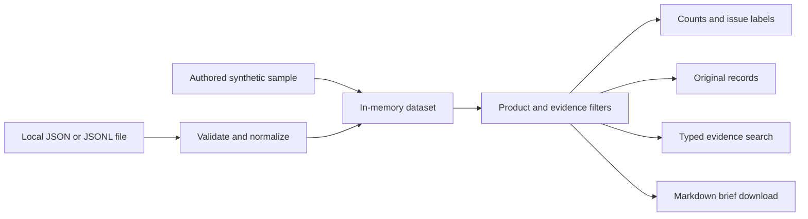
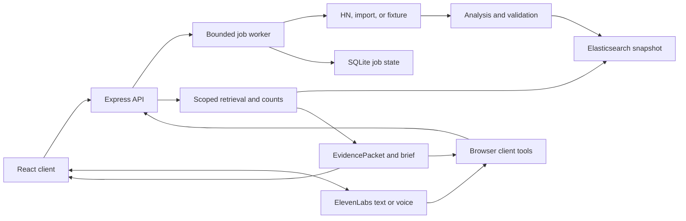
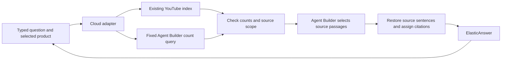

# Architecture

CUA Parse provides an OverHeard-style browser workspace for feedback inspection. Its public release calculates counts, filters evidence, searches loaded records, and exports a brief without a backend. The repository also preserves two connected research paths at `/research` in local service mode. These surfaces have separate data contracts.

## Public browser workspace

The public entry point imports only the workspace. It does not initialize a session, call an API, load a provider SDK, or ask for a microphone. The optional local entry point selects the preserved research client at `/research`; its link appears only on a loopback host.

The workspace follows this flow:

1. Open the authored 22-record sample or select a local file. Imports replace the sample in browser memory; they are not uploaded or saved to browser storage.
2. Validate normalized OverHeard records or raw collector records. Bound input to 5 MiB, 5,000 rows, and 20,000 characters per comment. Report invalid rows, repeated identities, and removed unsafe links.
3. Keep accepted original text. Identity includes organization, product ID, source, and native ID. Different IDs survive equal wording. For a repeated identity, keep the first accepted record and report the duplicate. Product display names are made unique across distinct organization/product identities.
4. Apply the selected product, source, sentiment, date, text, and thread exclusions. Overview, issue rankings, evidence, Vox, and brief use this same scope.
5. Calculate counts from supplied metadata. Unknown labels stay unknown. Records marked irrelevant remain visible in scope counts but do not enter issue rankings or answer examples.
6. Search eligible text, thread titles, and issue labels with deterministic rules. Vox selects up to four examples across sources. Brief export recalculates the current scope and selects up to eight examples. The full evidence list remains available separately.

Issue percentages use records not explicitly marked irrelevant as their denominator. A record may carry several issue labels. These counts are neither a severity score nor a claim about the wider market. Source engagement is not used to rank records across platforms.

The public contract lives in [model.ts](../src/workspace/model.ts). It is separate from the research API schemas. Imported author fields and arbitrary source metadata do not enter the browser record model. Source links are references; the importer does not fetch them. The UI renders source text as text. Selecting an external link is an explicit browser navigation.

The static build rejects backend and provider modules, disables environment-file loading, and enforces a 5 MiB artifact budget including media. Deployment headers block API connections and camera, microphone, and geolocation access. No service worker or storage layer retains imports. A reload returns to the synthetic sample.

## Preserved research jobs

1. A session starts a research job with a product, question, source mode, and idempotency key. That key lets an unchanged retry reuse the original operation.
2. The worker collects bounded records and persists its progress. Live collection uses fixed HN discovery and item APIs. Import validates supplied records without fetching their URLs. Fixture mode supplies declared synthetic data.
3. Analysis assigns product relevance and aspect labels. OpenAI responses must pass schema, identity, and exact source-span validation. Fixture labels have explicit synthetic provenance. Unlabelled mode does not claim model analysis.
4. Elasticsearch stores a fixed evidence snapshot for the job. SQLite holds sessions, job state, saved result views, and briefs.
5. A query applies the current filters and exclusions. Elasticsearch calculates metrics across the entire filtered scope. Retrieval selects examples from that same scope.
6. The API returns an `EvidencePacket`. The UI and conversation tools can inspect it, challenge a sentiment, or prepare a brief from the matching scope.

Jobs move through `queued → collecting → analyzing → indexing → ready`. Failure and cancellation are terminal alternatives. A ready job can contain partial collection or analysis failures; those remain visible. A restart marks interrupted jobs as failed. There is one worker and one API process per SQLite database, not a distributed queue.

## Preserved uploaded YouTube research

The product catalog is read from Elasticsearch without a model call. Each question includes an explicit product value. The Elasticsearch query and fixed ES|QL query apply that value, dates, and video exclusions. Returned originals must match the selected product and scope before they enter the explanation request.

The explanation request has tools and Elastic capabilities disabled. The server accepts only passages found in supplied originals, restores their sentence context, and assigns citation numbers. It generates count statements from query results. Uploaded sentiment, complaint, and category labels remain metadata.

`scopedRecords` is the selected product and filter denominator. `totalRecords` counts the whole upload across products. The explanation can include at most 500 complete comments within a 100,000-character context budget. All scoped records still contribute to the counts. Matching Elasticsearch and ES|QL totals do not make the source index immutable.

The adapter is read-only. It neither collects YouTube comments nor writes the uploaded index. Its `ElasticAnswer` is separate from `EvidencePacket`; the voice tools, snapshot challenge flow, and shared brief do not use it yet.

## Research-service contracts and invariants

The definitions in [contracts.ts](../src/shared/contracts.ts) are authoritative for the connected research API. They do not define browser file imports. A schema checks the shape of data. An invariant is a rule that must remain true across operations.

| Invariant                                         | Implementation boundary                                                                                              |
| ------------------------------------------------- | -------------------------------------------------------------------------------------------------------------------- |
| A record keeps its source identity                | Deduplicate repeated stable IDs only when content and context agree. Keep distinct IDs even when their text matches. |
| Every displayed quote comes from an original      | Validate source spans and retain sentence context, including negation. Source text is untrusted data.                |
| Metrics and examples use one scope                | Apply filters to full-scope aggregation and retrieval. Reject missing snapshot records.                              |
| One discussion cannot disappear from counts alone | Thread/video exclusion changes both metrics and returned originals.                                                  |
| A late reply cannot replace current research      | Keep research, snapshot, scope, and request identifiers; the client discards stale responses.                        |
| A retry does not become a different operation     | Compare the idempotency key or request ID with the full input, including product. Conflicting reuse fails.           |
| A session cannot query another session's research | API ownership checks cover research tools; conversation leases bind client tools to the session.                     |

The uploaded corpus is available to the local app's sessions. Product filtering is not tenant authorization. Do not treat it as access control for a private multi-tenant index.

## Code map

| Area                               | Main files                                                                                                           |
| ---------------------------------- | -------------------------------------------------------------------------------------------------------------------- |
| Browser workspace and scope        | [Workspace.tsx](../src/workspace/Workspace.tsx), [model.ts](../src/workspace/model.ts)                               |
| Browser sample and tests           | [sample.ts](../src/workspace/sample.ts), [workspace-model.test.ts](../tests/workspace-model.test.ts)                 |
| Public build and headers           | [build-workspace.mjs](../scripts/build-workspace.mjs), [vercel.json](../deployment/vercel.json)                      |
| Local surface selection            | [main.tsx](../src/client/main.tsx), [ResearchRoot.tsx](../src/client/ResearchRoot.tsx)                               |
| API, configuration, session checks | [app.ts](../src/server/app.ts), [config.ts](../src/server/config.ts)                                                 |
| Jobs and local state               | [jobs.ts](../src/server/jobs.ts), [storage.ts](../src/server/storage.ts)                                             |
| Collection and analysis            | [collection.ts](../src/server/collection.ts), [analysis.ts](../src/server/analysis.ts)                               |
| Scope, findings, and brief         | [elastic.ts](../src/server/elastic.ts), [findings.ts](../src/server/findings.ts), [brief.ts](../src/server/brief.ts) |
| Uploaded corpus                    | [elastic-cloud.ts](../src/server/elastic-cloud.ts), [ElasticResearch.tsx](../src/client/ElasticResearch.tsx)         |
| Conversation tools                 | [voice.ts](../src/client/voice.ts), [server voice.ts](../src/server/voice.ts)                                        |
| Preserved research UI              | [App.tsx](../src/client/App.tsx)                                                                                     |
| Repeatable source sample           | [AcmeFlow fixture](../fixtures/acmeflow.ts), [independent expected facts](../fixtures/acmeflow.expected.json)        |

In connected research mode, provider keys remain on the server. The browser receives a short-lived signed conversation connection, not the provider API key. The API uses HTTP-only session cookies, same-origin checks, and CSRF tokens. It binds to a local origin. Public hosting of the browser workspace does not expose this backend.

## Integration work that remains

Browser import compatibility does not connect the OverHeard team backend, Supabase tenancy, or a live team corpus. See [OverHeard alignment](OVERHEARD_ALIGNMENT.md) for the portable formats and current boundary.

X and Reddit collectors, a canonical multi-platform ingestion contract, source-deletion synchronization, and a shared voice/YouTube evidence service are proposed work. A source index can change after a query; the Cloud path has no point-in-time snapshot. Quote validation is a source check, not a guarantee of semantic truth.

See [Agent handoff](AGENT_HANDOFF.md) for data identity, product attribution, lifecycle, ownership, and migration proposals. See [Verification](VERIFICATION.md) for the difference between deterministic tests, live checks, and unverified behavior.
